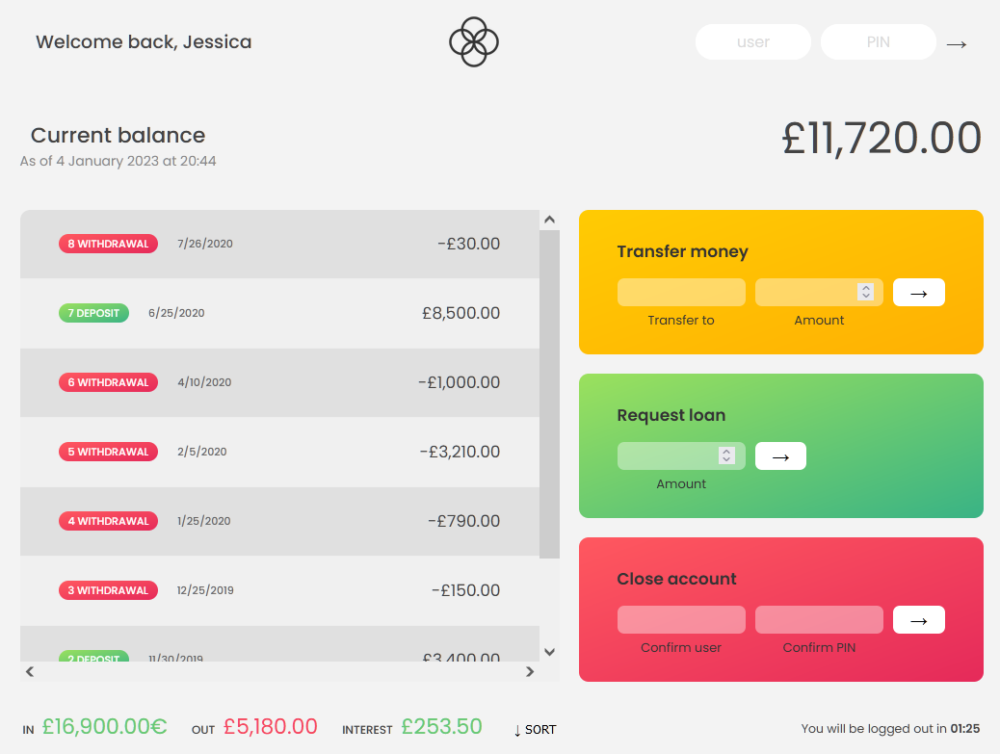

# 💸 Bankist

[Experiment with the live version.](https://waters1993.github.io/javascript-bankist/) Try each user account to see the currency and date format change

## Motivation & Acknowledgements

This project was created while completing "The Complete JavaScript Course 2021: From Zero to Expert!" by Jonas Schmedtmann

## Work Vs. Template Code

HTML elements and CSS styling were provided as a template file for this project. 
I created the applications functionality with JavaScript. 
Additional work involved colouring the tranactions table and adding a modal window to display login options for experimentation.

## JavaScript concepts and techniques used

- Callback functions 
- Manipulation of Objects, Maps, & Arrays (Looping & Destructuring) 
- Internationalization (Date & Currencies) 
- DOM Manipulation 
- Timers 
- String Manipulation 

## Description & Functionality

Bankist is a fictitious and minimalistic online banking application that allows the user to:

- Log in with a provide username and password
- View and sort their monetary movements
- Transfer money to another account
- Request a loan from the bank
- Delete their account

Landing page

## Built With

- HTML
- CSS
- JavaScript
- VS Code
- Git

## Author

- **James Waters**
  [james-waters](https://www.james-waters.com/)
